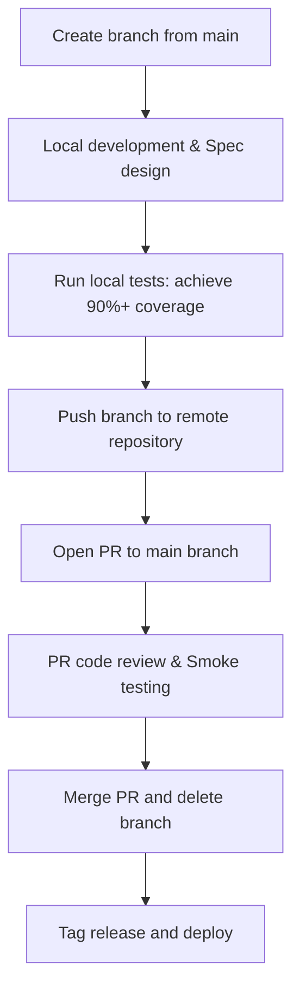

# Git Version Control and Branching Standards (Git Rules)

This document defines the branching model, commit message specifications, and Pull Request (PR) workflow for the ElsevierTrackor project. These rules ensure a clean, traceable repository history while safeguarding the absolute stability of the main branch.

---

## 1. Branching Strategy

### 1.1 Protected Main Branch
* **Branch Name**: `main` (or `master`).
* **Core Principle**: The main branch reflects production-ready code and must remain **deployable at all times**.
* **Constraints**: **Direct commits to the main branch are strictly prohibited.** Code can only be merged into the main branch via Pull Requests (PRs) that have passed all automated tests, manual acceptance, and code review.

### 1.2 Development and Fix Branches
All new features and bug fixes must be developed in dedicated branches created from the latest `main` branch. Branch names must use the following prefixes:

| Branch Prefix | Use Case | Example |
| :--- | :--- | :--- |
| `feature/` | Development of new features and requirements | `feature/user-notification-settings` |
| `bugfix/` | Resolving bugs identified during testing, QA, or normal operations | `bugfix/crawler-elsevier-selector-fix` |
| `hotfix/` | Emergency hotfixes for critical production issues (branched from `main`, merged back immediately) | `hotfix/session-leak-redis-limit` |
| `refactor/` | Code refactoring that does not alter any business functionality or API behavior | `refactor/api-response-wrapper` |

### 1.3 分支必须从最新的 `origin/main` 切出（不要从本地 `main`）

> [!WARNING]
> **永远从最新的远端 `origin/main` 创建分支，而不是本地 `main`。** 本地 `main` 可能落后/领先/分叉，带着**尚未推送、尚未验收**的本地提交。从这种本地 `main` 切分支，会把那些无关提交一起带进你的 PR；**squash 合并会把分支上所有非 base 提交打包成一个 commit**，于是一堆未验收的活被连同你的功能一起合并并触发 CI 部署到 prod。（本规则源于一次真实事故：一个 captcha PR 因基点错误，连带把 27 个未推送提交一起部署了。）

强制做法：
```bash
git fetch origin
git checkout -b feature/your-feature-name origin/main   # 直接以 origin/main 为基点
```
**推送/开 PR 前必须自检提交范围**，确认只含本次预期改动：
```bash
git log --oneline origin/main..HEAD   # 只应看到本次功能的提交；混入无关提交 = 基点错了
```
若发现混入无关/未验收提交，**先停下**，把分支 rebase 到 `origin/main` 或重切，不要直接合并。

---

## 2. Commit Message Convention (Angular Specification)

Every commit message **must** strictly adhere to the **Angular Team Commit Specification**. Commits without a type prefix or descriptive header are prohibited.

### 2.1 Commit Message Format

A complete commit message consists of three parts: a **Header** (required), a **Body** (optional), and a **Footer** (optional).

```text
<type>(<scope>): <subject>

<body>

<footer>
```

> [!IMPORTANT]
> **Every commit must start with a `<type>` prefix. The Header (the first line) must not exceed 50 characters.**

### 2.2 Header Components

#### 2.2.1 Type (Mandatory)
You must use one of the following official Angular commit types:

* `feat`: A new feature
* `fix`: A bug fix
* `docs`: Documentation-only changes
* `style`: Code formatting changes (white-space, formatting, missing semi-colons, etc.; no logic change)
* `refactor`: A code change that neither fixes a bug nor adds a feature
* `perf`: A code change that improves performance or user experience
* `test`: Adding missing tests or correcting existing tests
* `build`: Changes that affect the build system or external dependencies (e.g., npm, webpack, go mod updates)
* `ci`: Changes to CI configuration files and scripts (e.g., GitHub Actions, GitLab CI)
* `chore`: Other auxiliary changes that do not modify src or test files (e.g., config changes, task logs)
* `revert`: Reverts a previous commit

#### 2.2.2 Scope (Optional)
Identifies the specific module or area affected by the commit. In a monorepo, specifying the scope is highly recommended. Examples:
`backend`, `admin`, `frontend`, `crawler`, `db`.

#### 2.2.3 Subject (Mandatory)
* A concise summary of the changes.
* Do not capitalize the first letter of the description.
* Do not end the subject line with a period.

---

### 2.3 Body & Footer Components (Optional)

* **Body**: Explains the motivation behind the change and describes the implementation details. It is **highly recommended** for complex refactoring or significant logical updates.
* **Footer**: Used for the following scenarios:
  1. **Breaking Changes**: Must start with `BREAKING CHANGE: ` followed by a detailed description of what has changed and migration instructions.
  2. **Referencing/Closing Issues**: Mention related bug IDs or tasks, e.g., `Closes #123` or `Fixes #456`.

---

### 2.4 Complete Examples

#### Example 1: Standard Feature with Scope
```text
feat(backend): add resend email notification channel for admin alerts
```

#### Example 2: Bug Fix with Body
```text
fix(crawler): fix target selector parsing for Wiley publisher

The publisher changed the class name of the tracking status container from '.status-box' to '.status-container-new'. Updated the crawler selector to keep parsing stable.
```

#### Example 3: Refactoring with Breaking Changes in Footer
```text
refactor(api): change user login response structure

BREAKING CHANGE: The `user_token` field in the response is now renamed to `token` for consistency across services.
```

---

## 3. Pull Request (PR) Standard Workflow

To maintain code quality and integrate future CI/CD processes, all changes must follow this standard workflow:



### 3.1 Step-by-Step Guide
1. **Branch Creation**: Create a branch off the latest **`origin/main`**（见 §1.3，**不要**依赖可能分叉的本地 `main`）:
   ```bash
   git fetch origin
   git checkout -b feature/your-feature-name origin/main
   ```
2. **Local Development**: Write your code according to style rules, author the feature `spec` document, and prepare test cases.
3. **Local Testing**: Run unit and integration tests to ensure code coverage meets the 90%+ target.
4. **Push Changes**: Commit using the Angular standard and push to remote:
   ```bash
   git push origin feature/your-feature-name
   ```
5. **Version Bump Before PR**: When the user says to "push", "create PR", "push 上去创建 PR", or equivalent, update the WeChat Mini Program version before pushing unless the user explicitly says not to.
   * Source of truth: `frontend/utils/env.js`, constant `APP_VERSION`.
   * Default rule: increment the patch version by 1 (for example, `2.0.8` -> `2.0.9`).
   * Explicit override: if the user specifies a target version, use that exact version instead of auto-incrementing.
   * Commit the version bump as part of the PR branch before pushing.
6. **Open a PR**: Create a Pull Request from `feature/your-feature-name` to `main` on the repository hosting platform.
   * The PR title or body must include the Mini Program version from `frontend/utils/env.js` (for example, `Version: v2.0.9`).
7. **Acceptance and Merging**:
   * Verify all tests pass, edge cases are addressed, and no security vulnerabilities exist.
   * Merge the PR (we recommend `Squash and Merge` to keep the main branch history clean).
8. **Release Tagging**:
   * Tag major merges on the main branch using Semantic Versioning (e.g., `v1.2.0`) to mark stable deployments.
