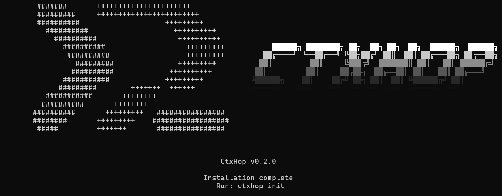
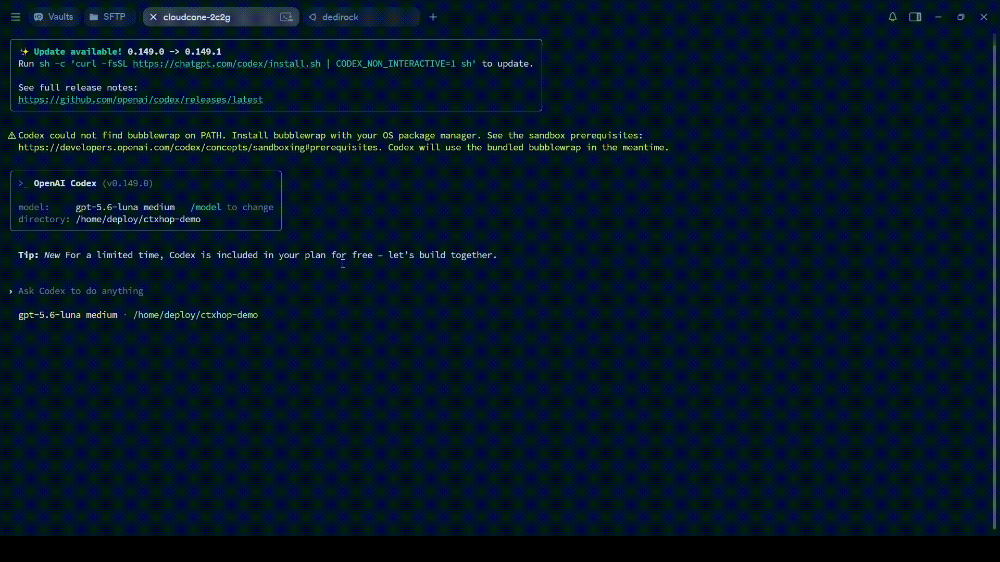

# CtxHop

  

  
  

  

English | [简体中文](README.zh-CN.md)

**Switch devices. Keep your context.**

CtxHop is a local-first CLI for carrying Claude Code and Codex Sessions between
devices. Bind a project, sync its Session records through storage you control,
and resume on any authorized device.

Session Hub groups Agent-native Sessions into logical Sessions, preserves their
source history, and lets you switch Agents by creating a target-native Session
from selected context. Workspace and Git handoff are explicit, while local
encryption and device authorization protect the sync boundary.

## Key Features

- **Cross-device Session resume**: Continue a project Session on another
  authorized device.
- **Session Hub**: Bring Claude Code and Codex Sessions into one logical
  Session while preserving their native sources and history.
- **Agent switching**: Use `ctxhop session switch` to carry selected context
  into a new native Session for another Agent.
- **Workspace handoff**: Move selected workspace files and Git state with the
  Session when needed.
- **Local-first storage**: Encrypt data on the device and store it in a backend
  you control.

## How It Fits Together

CtxHop uses a simple hierarchy:

~~~text
Domain
└── Hub
    └── Project
        └── Session
            ├── Claude Code native Session / Replica
            └── Codex native Session / Replica
~~~

- **Domain** is the encrypted sync boundary: its Remote namespace, keyfile,
  and authorized devices define one shared data space.
- **Hub** is a logical project space inside a Domain. It groups and isolates
  projects; a new Domain starts with a `default` Hub.
- **Project** is the project-level boundary for workspace, Git state, and Sessions.
- **Session** is the logical development context shared across Agents.

In normal use, Domain and the `default` Hub stay in the background. You work
with the current Project and its Sessions. Use another Hub only when you want
to keep groups of projects separate within the same authorized Domain.

## Demo

## Installation

Download the package for your operating system and CPU architecture from
[Releases](https://github.com/CCCCY-ci/ctxhop/releases).

### Windows

Download and run the installer for your CPU architecture:

- CtxHop-Setup_<version>_windows_amd64.exe
- CtxHop-Setup_<version>_windows_arm64.exe

The installer places CtxHop in `%USERPROFILE%\.ctxhop\bin` and adds that
directory to the current user's PATH. Administrator privileges are not required.
Open a new terminal and verify the installation:

~~~powershell
ctxhop version
~~~

For portable use, download `ctxhop_<version>_windows_<arch>.zip`, extract
`ctxhop.exe`, and add its directory to PATH.

### macOS / Linux

Choose the archive for your platform and CPU architecture:

- macOS Intel: `ctxhop_<version>_darwin_amd64.zip`
- macOS Apple Silicon: `ctxhop_<version>_darwin_arm64.zip`
- Linux x86_64: `ctxhop_<version>_linux_amd64.zip`
- Linux ARM64: `ctxhop_<version>_linux_arm64.zip`

In a terminal, extract and install the archive:

~~~bash
unzip ctxhop_<version>_<os>_<arch>.zip
sh install.sh
~~~

The default installation directory is `$XDG_BIN_HOME` when set, otherwise
`$HOME/.local/bin`. Set `CTXHOP_INSTALL_DIR` to use another user-level
directory:

~~~bash
CTXHOP_INSTALL_DIR=/path/to/bin sh install.sh
~~~

If the directory is not on PATH, the installer prints the required shell
configuration. Open a new terminal and verify the installation:

~~~bash
ctxhop version
~~~

### Install with Go (optional)

Requires Go 1.26 or later:

~~~bash
go install github.com/CCCCY-ci/ctxhop/cmd/ctxhop@latest
~~~

Ensure Go's binary directory is on PATH. Replace `@latest` with a release tag
when a pinned version is required.

### Initialize CtxHop

After installing the CLI on any platform:

~~~bash
ctxhop init
~~~

This configures storage, encryption, device identity, and Agent Hooks, then
creates or joins a sync domain.

### Uninstall

~~~bash
ctxhop uninstall
~~~

Uninstalling removes the local CLI, configuration, device keys, state, logs,
and CtxHop-installed Agent Hooks. Remote objects and local directory-backend
data are kept. If the directory backend overlaps the local configuration
directory, move the backend first.

## Quick Start: Cloudflare R2

This quick start uses Cloudflare R2. Other S3-compatible object stores follow
the same steps. Prepare an R2 bucket, its Access Key and Secret Access Key,
and a working copy of the project on both devices.

The commands use the automatically created `default` Hub.

Example R2 configuration:

~~~text
Endpoint: https://<ACCOUNT_ID>.r2.cloudflarestorage.com
Bucket:   <BUCKET_NAME>
Region:   auto
Prefix:   ctxhop/demo     # optional
~~~

Use the same bucket and prefix on every device in one sync domain.

### 1. Initialize device A

~~~bash
ctxhop init --backend s3 --endpoint "https://<ACCOUNT_ID>.r2.cloudflarestorage.com" --bucket "<BUCKET_NAME>" --region "auto" --prefix "ctxhop/demo" --device-name "device-a"
~~~

Follow the prompts for the R2 credentials and encryption password. Leave the
R2 session-token prompt empty when using a standard R2 API token. Store the
**Recovery Key** generated by the first initialization offline.

Choose whether to install Agent Hooks during initialization. Hooks push a
completed Session automatically; use `--no-hook` to skip them.

### 2. Bind the project and push

After completing a Session on device A, run these commands from the project
directory:

~~~bash
cd /path/to/project
ctxhop project bind --path .
ctxhop push
~~~

To include uncommitted workspace files and Git state, use:

~~~bash
ctxhop push --workspace
~~~

### 3. Authorize device B

Create an invitation on device A:

~~~bash
ctxhop device invite --output ctxhop-device-b.json
~~~

Transfer the invitation file to device B, then run:

~~~bash
ctxhop init --invite ./ctxhop-device-b.json --device-name "device-b"
~~~

Use device B's R2 credentials and the same encryption password.

### 4. Restore the Session

Prepare the project working copy on device B and bind it:

~~~bash
cd /path/to/project
ctxhop project bind --path .
ctxhop list
ctxhop resume <SESSION_ID>
~~~

After the restore, continue with the native Agent command:

~~~bash
# Codex
codex resume <SESSION_ID>

# Claude Code
claude --resume <SESSION_ID>
~~~

### Optional: Switch to another Agent

Cross-Agent switching creates a new target-native Session and keeps the source
Session unchanged:

~~~bash
# Preview the switch
ctxhop session switch <SESSION_ID> --to codex --preview

# Create and launch the target Session
ctxhop session switch <SESSION_ID> --to codex --launch
~~~

Use `--to claude-code` to switch to Claude Code.

## Synchronized Data

CtxHop synchronizes encrypted Session context and project identity by default.
Workspace files and Git state are included only when `--workspace` is used.
Agent configuration is filtered before synchronization.

| Data | Scope |
|---|---|
| Session context | Synchronized by default. Stored as encrypted Agent session records. |
| Project identity and Git summary | Synchronized by default. Used to match the same project across devices. |
| Agent environment | Filtered components selected during `init`, such as Skills, MCP intents, and allowed Session settings. |
| Workspace and Git state | Optional. Included only with `push --workspace` and `resume --workspace`. |
| Credentials and secrets | Never synchronized. This includes tokens, private keys, authentication files, headers, environment secrets, and `.env` files. |

Project files and complete Git repositories are outside the default
synchronization scope.

## CLI

Run `ctxhop <command> --help` for options. Use `ctxhop help <command> [action]`
to browse the command index. Run `ctxhop` in a terminal for the interactive
workspace; redirected input/output prints the command index. Type to filter,
use the arrow keys to move, and press Enter to run an action. Commands marked
`[--json]` support machine-readable output.

`<HUB>`, `<PROJECT_ID>`, `<SESSION_ID>`, `<REPLICA_ID>`, `<CONTRIBUTION_ID>`,
and `<NATIVE_ID>` are selectors supplied by you.

### Setup and navigation

| Command | Description |
|---|---|
| `ctxhop` | Open the interactive workspace. |
| `ctxhop init [options]` | Configure storage, encryption, device identity, and Agent Hooks. |
| `ctxhop install [--dir DIR] [--no-path]` | Install the CtxHop command. |
| `ctxhop update` | Check for and install the latest release. |
| `ctxhop uninstall [--dir DIR]` | Remove the local CtxHop installation. |
| `ctxhop help [<command> [action]]` | Show the command index or command options. |
| `ctxhop version` | Show the installed version. |

### Projects and synchronization

| Command | Description |
|---|---|
| `ctxhop project bind [--path DIR] [--identity ID or --name NAME] [--hub HUB]` | Bind a project to a stable identity and Hub. |
| `ctxhop project unbind [--path DIR or --identity ID]` | Remove a project binding. |
| `ctxhop project mode <MODE> [--path DIR or --identity ID]` | Set project sync mode: `normal`, `push-only`, or `excluded`. |
| `ctxhop project list [--hub HUB] [--json]` | List project bindings. |
| `ctxhop project discover [--json]` | Discover projects from authorized devices. |
| `ctxhop project move <PROJECT_ID> --to <HUB> [--json]` | Move a project to another Hub. |
| `ctxhop push [--workspace] [--git-stash STASH] [SESSION_ID]` | Push project Sessions and selected environment; `--workspace` includes workspace and Git state. |
| `ctxhop pull [--json]` | Read remote metadata. |
| `ctxhop list [--json]` | List Sessions in the current project. |
| `ctxhop resume [SESSION_ID] [options]` | Restore a Session and selected environment. |
| `ctxhop watch [--interval DURATION] [--once] [--json]` | Monitor local Agent Sessions and push updates. |

When no selector is provided, `ctxhop list` and `ctxhop resume` open the Session
picker. Use `ctxhop session list` to view logical Sessions, Agent sources, and
Replicas.

### Hubs and logical Sessions

Session Hub organizes Agent-native Sessions into logical Sessions and keeps
their source relationships. Resume within the same Agent with `session resume`;
continue in another Agent with `switch`.

| Command | Description |
|---|---|
| `ctxhop hub create [--json] <HUB>` | Create and publish a Hub. |
| `ctxhop hub list [--json]` | List Hubs and the current Hub. |
| `ctxhop hub use [--json] <HUB>` | Select the current Hub. |
| `ctxhop session discover [--json]` | Find local Agent Sessions and their Hub links. |
| `ctxhop session list [--json]` | List logical Sessions, Agent sources, and Replicas. |
| `ctxhop session show <SESSION_ID> [--json]` | Show a logical Session and its source metadata. |
| `ctxhop session resume <SESSION_ID> [options]` | Resume a native Replica on the current device. |
| `ctxhop session switch <SESSION_ID> [options]` | Preview or create a target-native Session from selected context. |
| `ctxhop session attach <SESSION_ID> [options] [--json]` | Attach an existing native Session to a logical Session. |
| `ctxhop session reconcile [options] [--json]` | Compare native Session state with its Hub binding. |
| `ctxhop session migrate [--json] [--preview] [--publish-v2] [--rollback] [SESSION_ID]` | Migrate legacy Session metadata into the logical Session view. |

Switch options:

| Option | Description |
|---|---|
| `--to AGENT` | Select the target Agent. |
| `--context causal-head`, `all-heads`, or `agent-only` | Select the context policy. |
| `--head CONTRIBUTION_ID` | Select a causal head; repeat for multiple heads. |
| `--source AGENT` | Select the source Agent for `agent-only`. |
| `--preview` | Preview the conversion plan without changing local state. Omit it to switch immediately. |
| `--with-environment` | Include portable environment components in the switch. |
| `--launch` | Launch the target Agent after the switch. |
| `--allow-unsupported` | Include unsupported records in the preview report. |

Migration commands:

~~~bash
ctxhop session migrate --preview
ctxhop session migrate <SESSION_ID> --publish-v2
ctxhop session migrate <SESSION_ID> --rollback
~~~

Without `--preview`, the selected migration runs immediately. `--publish-v2`
publishes the selected legacy branch as a Replica, and `--rollback` selects the
legacy reader.

### Devices and security

| Command | Description |
|---|---|
| `ctxhop device invite [--output PATH]` | Create a device invitation. |
| `ctxhop device status [--json]` | Show local device identity and mode. |
| `ctxhop device mode <MODE>` | Set the device mode. |
| `ctxhop device list [--json]` | List authorized devices. |
| `ctxhop device rename <NAME>` | Rename the local device. |
| `ctxhop device remove <DEVICE_ID>` | Revoke a device. |
| `ctxhop device rotate-key` | Rotate the encryption key. |
| `ctxhop passphrase change` | Change the encryption password. |
| `ctxhop passphrase reset` | Reset the encryption password with the Recovery Key. |
| `ctxhop hook install [--agent all, claude-code, or codex]` | Install SessionEnd Hooks for selected Agents. |

### History and remote data

| Command | Description |
|---|---|
| `ctxhop history [--json] <SESSION_ID>` | List Session versions. |
| `ctxhop history cleanup [--remote-id] [--path DIR] <SESSION_ID>` | Delete all remote versions for a Session. |
| `ctxhop history prune [--remote-id] [--path DIR] (--keep N or --before RFC3339) <SESSION_ID>` | Keep the latest versions or remove versions before a time. |
| `ctxhop remote delete-session [--remote-id] [--path DIR] <SESSION_ID>` | Delete a remote Session. |
| `ctxhop remote delete-project [--path DIR]` | Delete remote data for the current project. |
| `ctxhop remote delete-all` | Delete remote data in the current sync domain. |

Use `--remote-id` to target an opaque remote ID.

### Status and maintenance

| Command | Description |
|---|---|
| `ctxhop status [--remote] [--json]` | Show sync status; `--remote` includes the remote status. |
| `ctxhop doctor [--json]` | Check configuration, backend, Agent, project, and Hook state. |
| `ctxhop stats [--json]` | Show cross-device restore statistics. |

## Configuration

CtxHop stores local configuration, device keys, and sync state in:

| System | Default directory |
|---|---|
| Windows | `%USERPROFILE%\.ctxhop` |
| macOS / Linux | `~/.ctxhop` |

Set `CTXHOP_CONFIG_DIR` to use another directory:

~~~bash
export CTXHOP_CONFIG_DIR="$HOME/.ctxhop-custom"
~~~

PowerShell:

~~~powershell
$env:CTXHOP_CONFIG_DIR = Join-Path $env:USERPROFILE '.ctxhop-custom'
~~~

This directory contains local configuration and device keys. Do not commit it
to a repository or share it publicly.

## Development

Requires Go 1.26 or later.

Clone and build:

~~~bash
git clone https://github.com/CCCCY-ci/ctxhop.git
cd ctxhop
go build -trimpath -o ctxhop ./cmd/ctxhop
./ctxhop install
~~~

On Windows PowerShell:

~~~powershell
go build -trimpath -o ctxhop.exe ./cmd/ctxhop
.\ctxhop.exe install
~~~

Run the basic checks:

~~~bash
go test ./...
go vet ./...
~~~

Before submitting changes:

~~~bash
go test -race ./...
~~~

Build all supported targets:

~~~bash
bash scripts/build.sh
~~~

On Windows PowerShell:

~~~powershell
.\scripts\build.ps1
~~~

Do not commit real Session files, tokens, or backend credentials.

## License

CtxHop is licensed under the [MIT License](LICENSE).
